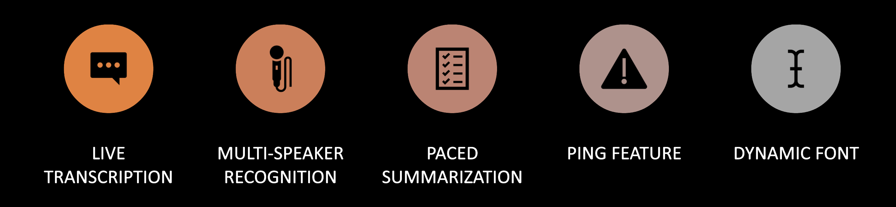
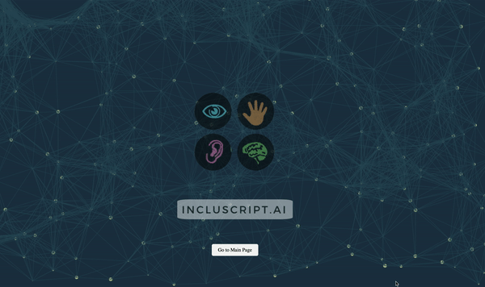

  

## Inspiration
Imagine going through school struggling to follow class discussions because you have single-sided deafness, or struggling to keep up with Zoom captions because of learning disabilities. A typical classroom turns into an exhausting, isolating experience. These struggles were the catalyst for IncluScript.ai.

  

## What it does
IncluScript.ai is an innovative solution designed to bridge the gap in accessible education. Features like live transcription and multi-speaker recognition ensure that everyone, regardless of their auditory abilities, can participate in educational settings. Our paced summarization feature also distills complex information, making it easier for learners to grasp key points at their own pace.

## How we built it
Building IncluScript.ai was a blend of technological innovation and human-centered design. We kicked off our project by identifying the core needs of our audience, which informed the features we prioritized: live transcription, multi-speaker recognition, and paced summarization.

We crafted IncluScript.ai by integrating a speech-to-text engine for live transcription, leveraging GPT and NLP for paced summarization, utilizing HuggingFace for multi-speaker recognition, hosting on Google Cloud Platform for scalability, and developing a user-friendly interface with HTML, CSS, and JavaScript, all while employing Git for version control.

## Challenges we ran into
Our biggest hurdle was the time constraint. Building a robust, fully-featured platform in a limited time frame was daunting, but it pushed us to prioritize and execute efficiently.

## Accomplishments that we're proud of
We're particularly proud of our multi-speaker recognition feature, implemented using HuggingFace. This differentiates us from standard transcription services and brings us one step closer to universal accessibility.

## What we learned
The project revealed the untapped potential of generative AI in both accessibility and education. It's amazing how technology can break down barriers and bring inclusive experiences to all.

## What's next for IncluScript.ai
We're planning to roll out additional features like dynamic fonts to better comprehend voice intensity and a 'ping names' feature to make multi-speaker environments even more accessible.

## Built With
css, gcp, git, gpt, html, huggingface, javascript, natural-language-processing, python, speech-to-text

